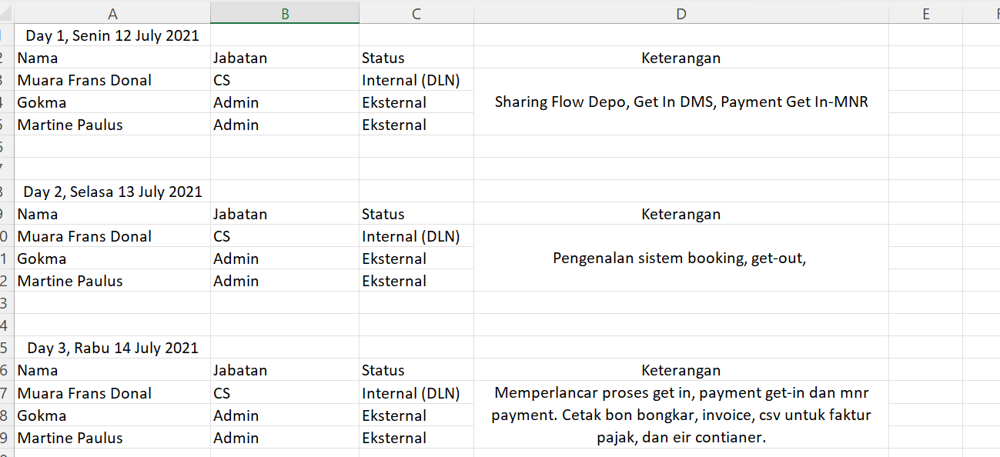
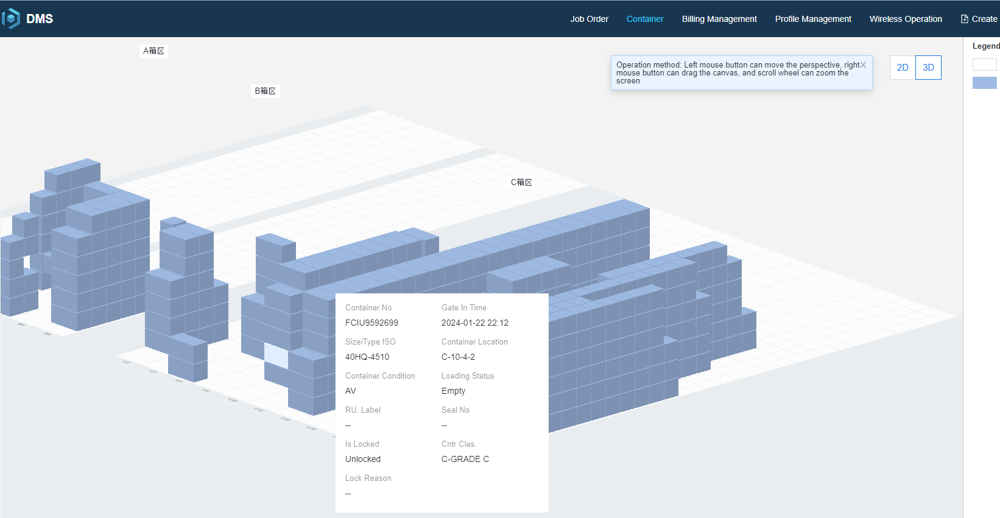
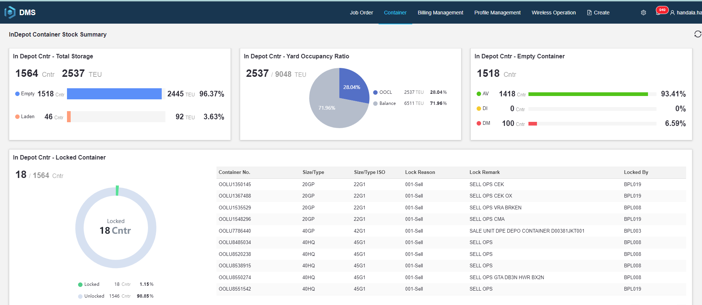
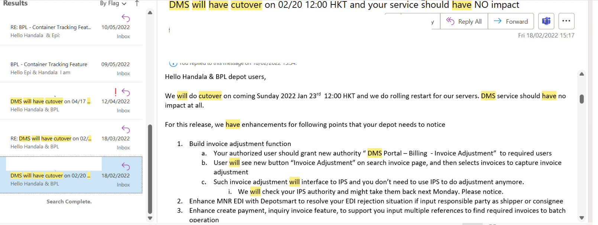

# DMS-Implementation
BPL merupakan perusahaan Join Venture antara Temas Tbk dan OOCL Logistics. Sistem yang digunakan DMS (Depot Management System), yang sudah ada dengan standar penggunaan di Hong Kong. Awal penerapannya pada BPL saya melakukan analisa dan melakukan testing secara menyeluruh terhadap DMS, dikarenakan adanya perbedaan kegiatan operational antara Depot Container yang di Hong Kong dengan Indonesia. Saya berdiskusi dengan tim IT BA dari Hong Kong, untuk melakukan customisasi di beberapa fitur. Saya bertanggung jawab penuh terhadap sistem DMS yang akan digunakan di perusahaan BPL.
DMS mencakup kegiatan Gate In, Gate Out, Payment, Tax, 2D & 3D Container Yards, Volume Container, MnR dan lain sebagainya. Hingga saat ini saya dan tim Support DMS terus melakukan pengembangan sesuai dengan perkembangan bisnis Depot di Indonesia.
## Analisa kebutuhan sistem
Analisa kebutuhan diperlukan untuk melakukan proses _adjust_ antara proses bisnis dari Hong Kong dan Indonesia.
- Berdasarkan proses bisnis depot container yang sudah saya pahami dari perusahaan sebelumnya, sehingga saya dan managemen bisa menyusun sistem DMS yang dapat di jalankan pada PT. Bunga Plum Logistik.
- Saya berdiskusi via email, serta video conferece bersama tim BA HK.
## Melakukan training sistem DMS
Training bertujuan agar semua lapisan karyawan dapat bekerja dengan baik menggunakan sistem DMS.

- Menu Gate In, Gate Out, Payment, Tax, serta Data Stock Container untuk divisi Customer Service.
- Menu Container Yard 2D & 3D untuk divisi Stacker dan Operator Side Loader.

- Menu MnR (Maintenence and Repair) untuk divisi Estimator.
- Menu Reporting, Invoice Adjustment untuk Manager Operational.

## Pengembangan sistem DMS
Pengembangan dilakukan secara berkala, sesuai permintaan dari PT. Bunga Plum Logistik. Masih banyak pengembangan yang terus dilakukan, sesuai perkembangan bisnis depot bongkar muat Container di Indonesia.
- Contoh email sebagai berikut:

## Pengembangan berikutnya
Saya bersama tim developer dari pusat(HK) terus melakukan pengembangan secara bertahap.
- Mobile MNR
_Aplikasi Mobile MNR bertujuan untuk mempermudah tim surveyor dalam melakukan survey yang sebelumnya masih menggunakan kertas. Aplikasi Mobile MNR akan terintegrasi dengan DMS sehingga penginputan item kerusakan pada container dapat dilakukan dalam satu tahapan saja._
- EDI Integration
_Integrasi EDI akan mempermudah tim Customer Service dalam penginputan detail Gate In/Gate Out. Data sudah terintegrasi dari sistem Booking Acknowledge dari OOCL, sehingga cukup di trigger dengan nomor BA detail informasinya akan muncul otomatis._
- EService
- TRT System

  
